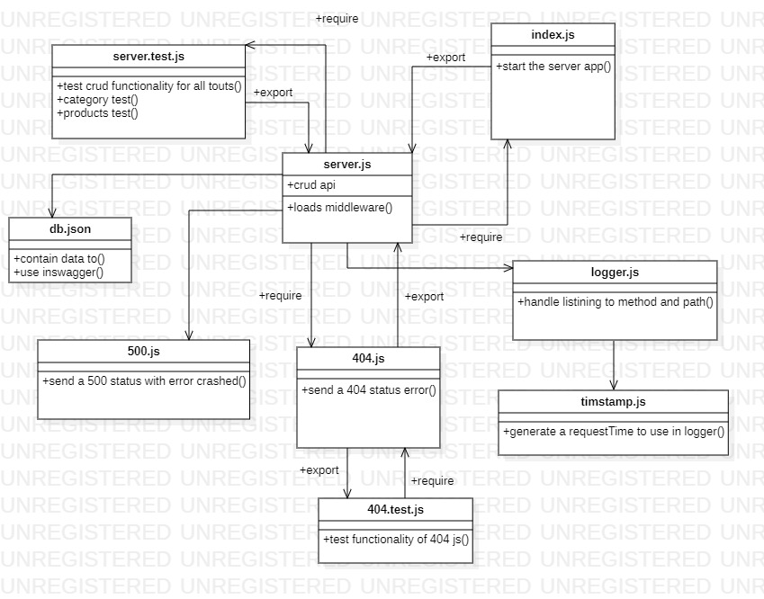
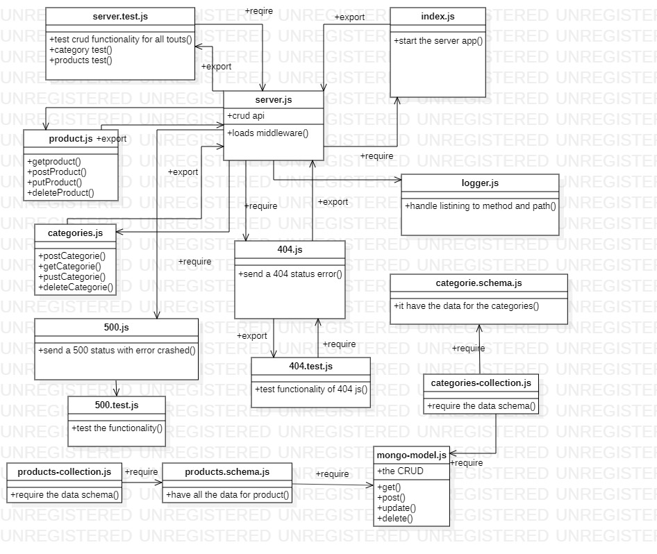
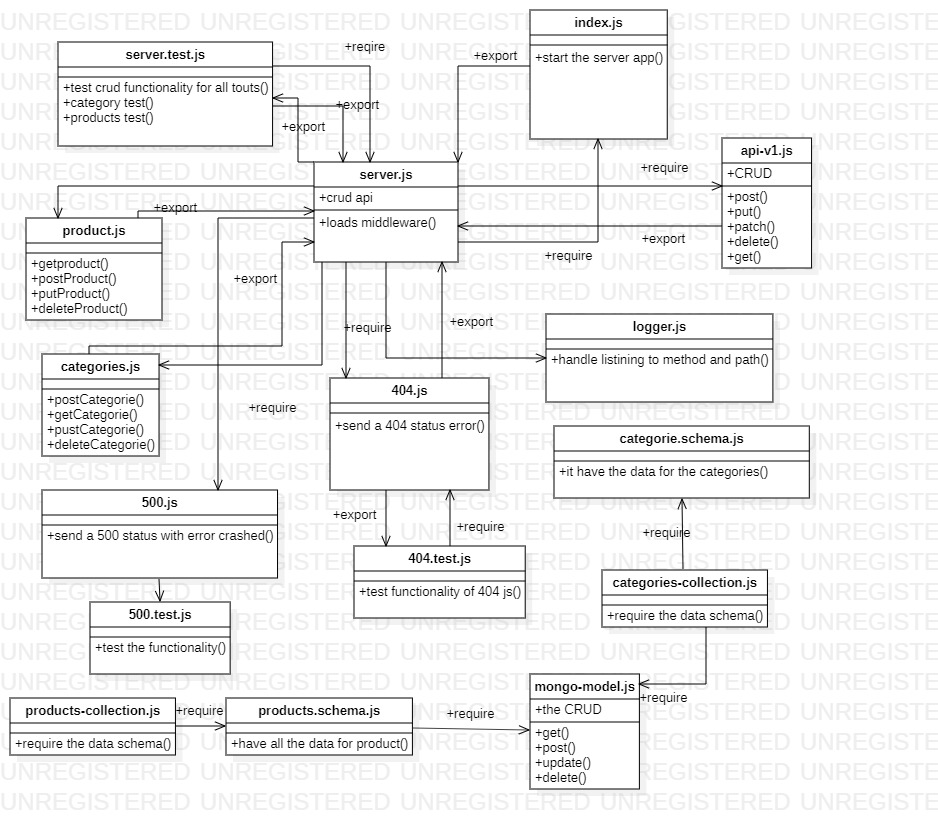

# api-server


# Swager Documentation Hub
lab 6 
https://app.swaggerhub.com/apis/laith/default-title/0.1

lab 7 
https://app.swaggerhub.com/apis/laith-2020/default-title/0.1


**labs**     | **URL**
------------ | -------------
Home         | [Home](https://github.com/laith-401-advanced-javascript/notes)
 class-01    | [class-01](https://github.com/laith-401-advanced-javascript/notes/pull/1)
 class-02    | [class-02](https://github.com/laith-401-advanced-javascript/notes/pull/2)
 class-03    | [class-03](https://github.com/laith-401-advanced-javascript/notes/pull/3)
 class-04    | [class-04](https://github.com/laith-401-advanced-javascript/notes/pull/4)
  class-06    | [class-06](https://github.com/laith-401-advanced-javascript/api-server/pull/1)
  class-07   | [class-07](https://github.com/laith-401-advanced-javascript/api-server/pull/2)
  class-08   | [class-08](https://github.com/laith-401-advanced-javascript/api-server/pull/3)
  class-09   | [class-09](https://github.com/laith-401-advanced-javascript/api-server/pull/4)


# labs

From a business requirements standpoint, once again, nothing changes. Our API must continue to work as advertised on day 1. The focus of this phase is purely on refactoring. That means we’ll be targeting creating elegant, highly performant code that scales well and is extensible.

Specifically, from the API side, we will be combining our router modules into a single module that can load the correct model dynamically. On the data model side, we’ll be DRYing up the collection module for our 2 data models into a common “mongo” collection so that adding new data models in the future is as easy as adding a schema file


#### How to initialize/run your application (where applicable)

-  `node index.js`


### date
Date published

---
date: 2020-9-7 10:00
---

### author

author: Laith Al Daree
---

### location

---
location: Az Zarqa-Al Azraq-Jordan
---


### Contact 
```
---
Email:mr.laith_2011@hotmail.com
GitHub:https://github.com/laith-2020
linkedIn :https://www.linkedin.com/in/laith-aldaree/
---
```


* if you have any quastion feel free to send me an 
  email : mr.laith_2011@hotmail.com


# Action gitHub link 
[actiontest](https://github.com/laith-401-advanced-javascript/api-server/actions/runs/256352473)


# uml

lab 7


lab 8


lab 9

